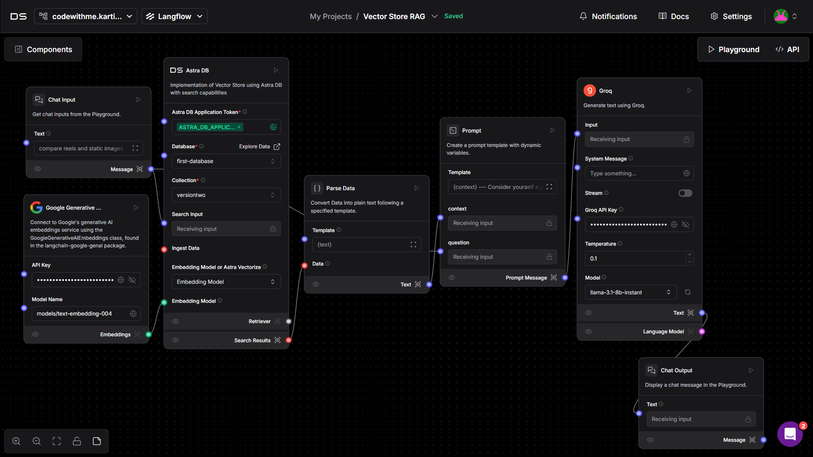
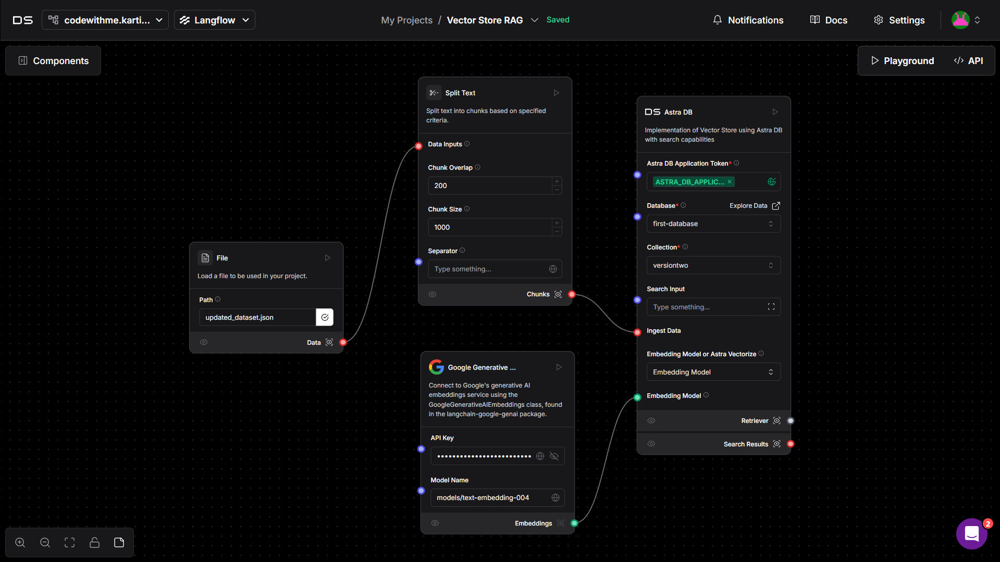
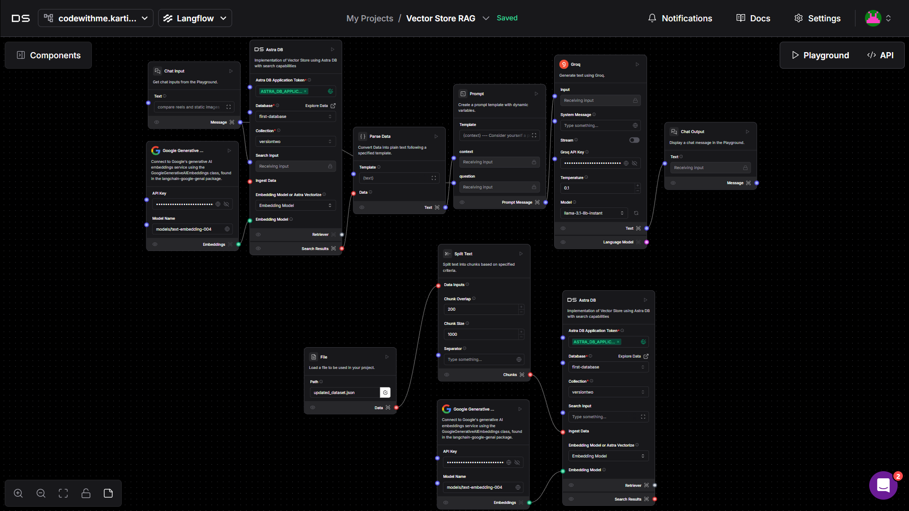

# Hisaab by Team RM -RF /* 

An advanced social media analytics platform delivering deep insights into your social media engagement using AI-powered tools. Developed for the Level Supermind Hackathon, Hisaab leverages DataStax Astra DB and Langflow to analyze data and provide actionable recommendations. 

---

## 👁️ About Hisaab  

Hisaab is your intelligent companion for social media analytics, helping you:  
- Analyze engagement trends across various post formats.
- Generate AI-driven insights to optimize content strategies.
- Provide performance metrics via an intuitive dashboard.
- Enable tracking and comparison of metrics across different content types. 

---

## 🌟 Key Features  

### **📊 Comprehensive Analytics Dashboard**  
- Real-time engagement monitoring.
- Interactive data visualizations.
- Historical performance trend analysis.
- Comparative insights for better decision-making

### **🤖 AI-Powered Insights**  
- GROQ-generated content recommendations.  
- Engagement pattern detection.  
- Performance prediction.  
- Content optimization suggestions.  

### **📈 Post Type Analysis**  
- Comprehensive comparison across:  
  - Carousel posts.  
  - Reels.  
  - Static images.  
  - Threads
  - Video

---

## 🚀 How It Works

1. **Datastax Astra DB** stores and manages social media engagement data.

2. **Langflow** generates AI-driven insights and content recommendations.

Datastax-Langflow flow:
    
    
    

3. **GROQ** analyzes engagement patterns and predicts performance metrics.

4. **Vite-React** provides an intuitive user interface for data visualization and analytics.

5. **NodeJS/Express** powers the backend server for API calls and data management.

---

## 🏗️ How to Get Started
## **Run Locally**

### Prerequisites:

- Install Node.js.
- Access to **Datastax Astra DB**.

### Steps:

1. Clone this repository:
   ```bash
   git clone https://github.com/Kartik8Dwivedi/Hisaab.git
   cd hisaab
   ```
2. Install dependencies:
   ```bash
   cd frontend/
   npm install
   ```
   ```bash
   cd backend/
   npm install
   ```
3. Set up your environment variables in backend folder, under a `.env` file in root directory:
   ```bash
    PORT=''
    BASE_URL=''
    LANGFLOW_ID=''
    FLOW_ID=''
    APPLICATION_TOKEN=''
   ```
4. Start the application:
   ```bash
   cd backend/
   npm run dev
   ```
   ```bash
   cd frontend/
   npm run dev
   ```


---

## Client Side Screenshots


---

## 🛠️ Tech Stack  

- **DataStax Astra DB**: For database management and operations.  
- **Langflow**: For workflow creation and GPT integration.  
- **OpenAI API key**: To generate AI-driven insights.  
- **Vite-React**: For building the user interface and analytics dashboard.
- **NodeJS/Express**: Backend Server for API calls and data management.  

---

## Video Demo

[](https://www.youtube.com/watch?v=tkvlxZkCES8)

---

## 🎯 Vision
Hisaab aims to transform how creators and businesses analyze and enhance their social media performance. By combining cutting-edge AI technologies with powerful analytics, it empowers users with actionable strategies for growth.

## 👥 Team RM -RF /*
Meet the minds behind EngageLens:

- [Tathagat Sahay](https://github.com/Tathagatsahay)
- [Pragya Dave](https://github.com/pragya0702)
- [Aaryan Tripathi](https://github.com/Aaryan1311)

<hr>
<h3>Created with ❤️ by Team RM -RF /*</h3>