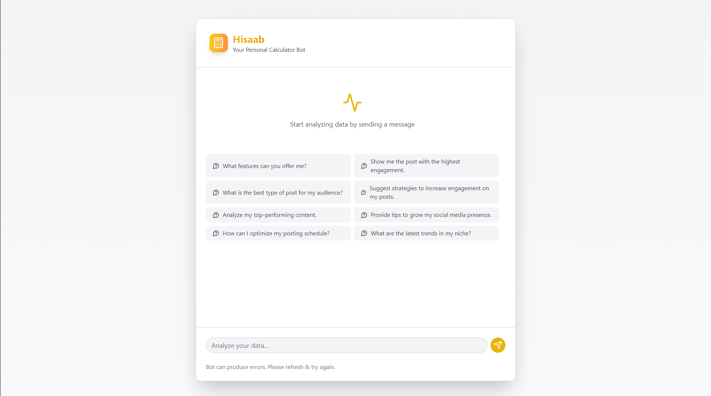
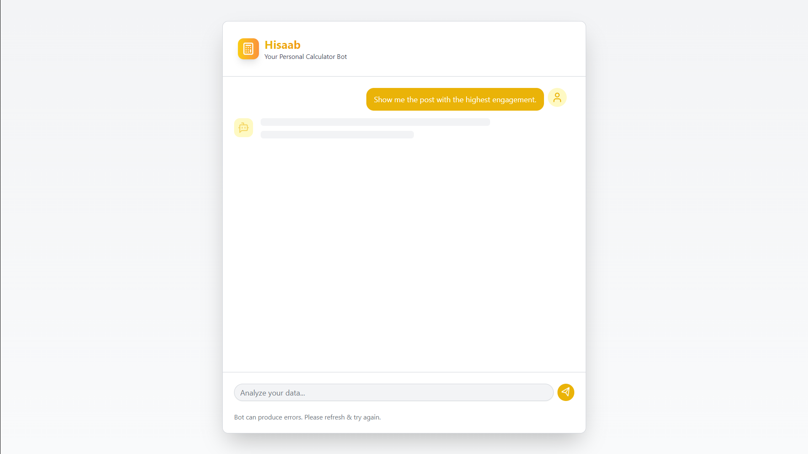
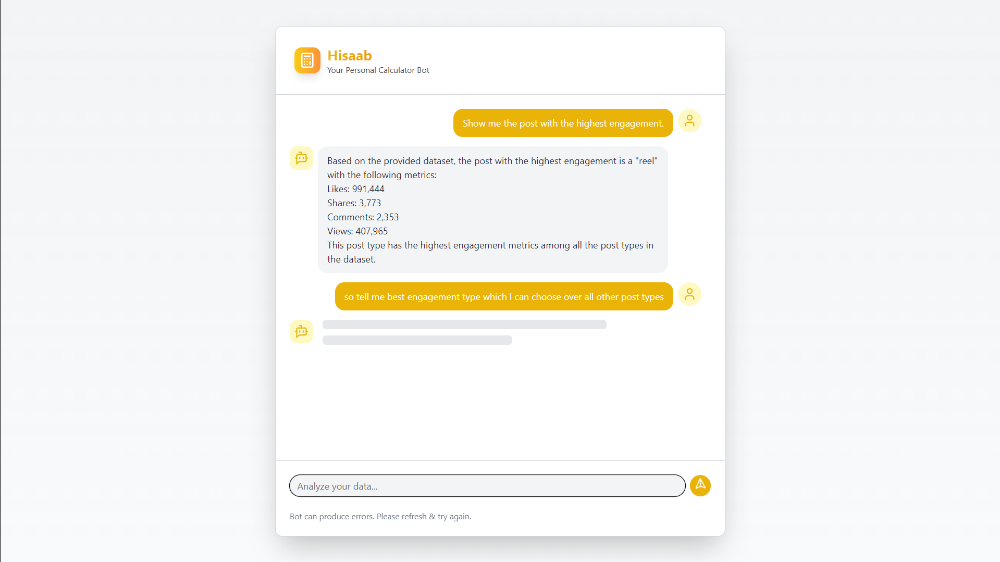

# Hisaab by Team RM -RF /* 

A powerful social media analytics platform that provides deep insights into your social media engagement through an AI-powered lens. Built for the **Level Supermind Hackathon**, EngageLens leverages **DataStax Astra DB** and **Langflow** to analyze engagement data and deliver actionable insights.  

---

## 👁️ About Hisaab  

Hisaab is your intelligent companion for social media analytics, helping you:  
- Analyze engagement patterns across different post types.  
- Generate AI-powered insights for content optimization.  
- Visualize performance metrics through an intuitive dashboard.  
- Track and compare metrics across various content formats.  

---

## 🌟 Key Features  

### **📊 Smart Analytics Dashboard**  
- Real-time engagement tracking.  
- Interactive data visualization.  
- Historical trend analysis.  
- Performance comparisons.  

### **🤖 AI-Powered Insights**  
- GROQ-generated content recommendations.  
- Engagement pattern detection.  
- Performance prediction.  
- Content optimization suggestions.  

### **📈 Post Type Analysis**  
- Comprehensive comparison across:  
  - Carousel posts.  
  - Reels.  
  - Static images.  
  - Threads
  - Video

---

## 🚀 How It Works


---

## 🏗️ How to Get Started
## **Run Locally**

### Prerequisites:

- Install Node.js.
- Access to **Datastax Astra DB**.

### Steps:

1. Clone this repository:
   ```bash
   git clone https://github.com/Kartik8Dwivedi/Hisaab.git
   cd hisaab
   ```
2. Install dependencies:
   ```bash
   cd frontend/
   npm install
   ```
   ```bash
   cd backend/
   npm install
   ```
3. Set up your environment variables in backend folder, under a `.env` file in root directory:
   ```bash
    PORT=''
    BASE_URL=''
    LANGFLOW_ID=''
    FLOW_ID=''
    APPLICATION_TOKEN=''
   ```
4. Start the application:
   ```bash
   cd backend/
   npm run dev
   ```
   ```bash
   cd frontend/
   npm run dev
   ```


---

## Client Side Screenshots







---

## 🛠️ Tech Stack  

- **DataStax Astra DB**: For database management and operations.  
- **Langflow**: For workflow creation and GPT integration.  
- **OpenAI API key**: To generate AI-driven insights.  
- **Vite-React**: For building the user interface and analytics dashboard.
- **NodeJS/Express**: Backend Server for API calls and data management.  

---

## 🎯 Vision
EngageLens aims to revolutionize how creators and businesses understand and optimize their social media performance. By combining cutting-edge AI technology with robust analytics, we provide insights that are not just data points, but actionable strategies for growth.

## 👥 Team RM -RF /*
Meet the minds behind EngageLens:

- [Tathagat Sahay](https://github.com/Tathagatsahay)
- [Aaryan Tripathi](https://github.com/Aaryan1311)
- [Pragya Dave](https://github.com/pragya0702)

<hr>
<h3>Created with ❤️ by Team RM -RF /*</h3>